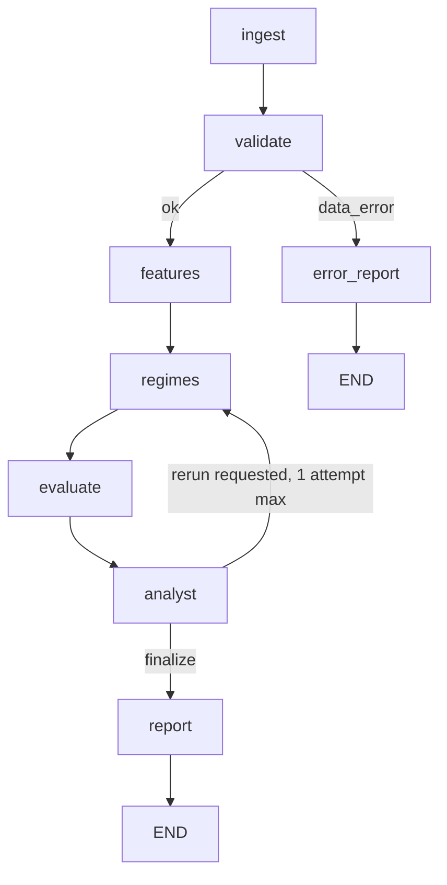

# Architecture walkthrough

This is the written walkthrough deliverable for the regime-detection agent: what it
does, how it reasons, why it's built this way, where it's weak, and what would come
next. It's written to stand in for a video walkthrough.

## 1. What this is

An autonomous pipeline that, given nothing but a daily invocation, fetches fresh market
data, engineers a focused set of regime-relevant features, fits a statistical regime
model, sanity-checks its own output, writes a dated research note in natural language,
and stores everything in a structured, append-only history. It is designed to be run
once a day (locally or via the included GitHub Actions workflow) and to keep working
indefinitely as new data arrives.

It is **not** a trading strategy or a source of investment advice. It describes
historical and current statistical regime behavior. See [Limitations](#7-limitations)
for exactly where the line is and why.

## 2. Why LangGraph

The brief calls for "an agentic framework of your choice capable of chaining reasoning
steps, calling Python functions, performing intermediate evaluations, and summarizing
results." Three frameworks were considered:

- **CrewAI** -- role-based "crew of agents," simple mental model, but less explicit
  control over execution order and conditional branching.
- **AutoGen** -- conversational multi-agent, agents talk to each other to drive the
  workflow. More emergent/flexible, harder to make deterministic for a daily batch job
  that has to produce the same kind of output reliably every day.
- **LangGraph** -- a typed state machine (nodes, edges, conditional edges) with
  first-class support for mixing deterministic Python steps and LLM-driven steps in the
  same graph. **Chosen.**

The deciding factor: most of this pipeline (data fetching, feature math, statistical
model fitting) should be deterministic and auditable -- you do not want an LLM
"deciding" how to compute rolling volatility, and you do not want a daily research note
that's a different shape every time purely because an agent's free-form planning
varied. LangGraph lets the deterministic steps be plain Python functions wired through
an explicit graph, while reserving actual LLM reasoning for the one place it earns its
keep: judging whether a model fit looks statistically sound, and writing the narrative.
That is a deliberate reliability tradeoff, discussed more in
[Limitations](#7-limitations).

## 3. Agent roles and responsibilities

| Node | Responsibility | Deterministic or LLM-driven |
|---|---|---|
| **Data ingestion agent** (`ingestion.py`) | Incrementally fetch & cache daily OHLCV (Yahoo Finance) and macro series (FRED via `pandas_datareader`); backfill if the configured start date moves earlier than the cache | Deterministic |
| **Validation gate** (`orchestrator.validate_node`) | Check fetched data is sufficient (non-empty, benchmark present, >= 1 trading year); route to an error-report path instead of crashing | Deterministic (conditional edge) |
| **Feature engineering agent** (`features.py`) | Compute volatility, cross-sectional dispersion, a PCA-based correlation-breakdown signal, Amihud illiquidity / volume shocks, and macro proxies (VIX, yield curve, HY spread) | Deterministic |
| **Regime detection agent** (`regimes.py`) | Fit a Gaussian HMM (primary) plus GMM and KMeans (baselines); pick the state count by BIC; canonically relabel states so "0" always means calmest | Deterministic |
| **Evaluation agent** (`evaluation.py`) | Per-regime return/risk statistics, an ANOVA test for return separation, degeneracy/distinctness flags, cross-method label agreement, sanity-check against known historical events | Deterministic |
| **Analyst agent** (`llm.py`) | Reviews the evaluation output; may request **one** bounded re-run with a smaller state count if something looks degenerate; otherwise writes the note's narrative sections | **LLM tool-calling (Claude)**, with a deterministic template fallback when no API key is set |
| **Report-writer** (`report.py`) | Renders the markdown note + a regime-shaded price chart + a JSON metadata sidecar; appends a row to the longitudinal history log | Deterministic |

## 4. Reasoning flow

The graph (`orchestrator.build_graph`) is a state machine over a single typed
dictionary (`PipelineState`) that accumulates results as it flows through the nodes:

The one cycle in this graph -- `analyst -> regimes -> evaluate -> analyst` -- is the
"chaining reasoning steps... performing intermediate evaluations" part of the brief
made concrete: the analyst agent is hands the *computed statistics*, not raw data, and
has exactly two moves available (`request_rerun(n_states, reason)` or
`finalize_report(...)`), enforced via Claude's tool-calling with `tool_choice` forced
to one of those two tools. If it requests a re-run, `regime_node` refits with the
requested state count, `evaluate_node` recomputes statistics against the new fit, and
`analyst_node` is called again -- this time with `allow_rerun=False`, so the tool list
only contains `finalize_report` and the loop is structurally incapable of running more
than once. This bound is enforced twice (once by which tools are even offered to the
model, once by `config.regimes.llm.max_rerun_attempts`), not by trusting the model to
stop on its own.

When `ANTHROPIC_API_KEY` is unset, `_deterministic_analyst` reproduces the same
decision logic (rerun if there's a degeneracy flag and a smaller candidate exists,
otherwise synthesize the narrative from the actual computed numbers) without calling
out to any LLM. This means the pipeline is fully functional, end to end, on a machine
with no API key and no network access beyond Yahoo Finance/FRED -- which matters for
CI, grading, and anyone evaluating this without wanting to hand over a key.

## 5. Data and methodology

**Universe**: SPY (benchmark) + 9 "classic" Select Sector SPDRs (XLY, XLP, XLE, XLF,
XLV, XLI, XLB, XLK, XLU), all trading continuously since December 1998. Two newer
sector funds -- XLC (Communication Services, launched June 2018) and XLRE (Real
Estate, launched October 2015) -- are deliberately excluded. Early development
included them, and requiring all 11 sector returns to be simultaneously non-null
silently truncated every cross-sectional feature (dispersion, correlation, PCA) to
~2018-12 onward, discarding 2010-2018 (including the 2011 European-debt-crisis vol
spike and the 2015-16 China/oil selloff) for no good reason. Dropping the two young
funds restores the full configured history (2010-present) at the cost of two GICS
sectors' worth of granularity.

**Features**, one per required category:

- *Volatility*: rolling realized volatility of the benchmark at 5/21/63-day windows
  (annualized).
- *Return dispersion*: rolling mean of the cross-sectional standard deviation of
  same-day sector returns.
- *Correlation breakdown*: a rolling PCA on sector returns; the first principal
  component's explained-variance share. This rises when sectors move together (a
  systemic, single-factor regime -- the textbook "correlations go to 1 in a crisis")
  and falls when moves are more idiosyncratic.
- *Liquidity shocks*: cross-sectional average Amihud illiquidity (`|return| / dollar
  volume`) and a volume z-score.
- *Macro proxies*: VIX level and 5-day change; 10Y-2Y Treasury yield slope and
  high-yield OAS spread, both from FRED.

All rolling computations are backward-looking only (a value at date *t* uses data
through *t* inclusive, never beyond) -- verified directly in `tests/test_features.py`
by perturbing future values and asserting past feature values don't change. This
matters because the historical "face validity" check below only means something if the
model can't see the future.

**Regime model**: a `hmmlearn` Gaussian HMM with diagonal covariance is the primary
method, because regimes persist -- an HMM's transition matrix captures that
day-to-day stickiness, where independent per-day clustering (GMM, KMeans) does not. The
state count is chosen by minimizing HMM BIC over candidates `{2, 3, 4}`. That range is
deliberately narrow: early testing allowed up to 5 states, and BIC kept improving by
carving out a near-duplicate state (two states with almost identical volatility/VIX
means) rather than finding a genuinely new regime. Rolling-window features are heavily
autocorrelated across adjacent days, which violates the i.i.d. assumption behind BIC's
penalty term and biases selection toward over-segmentation. Capping the search range,
plus the evaluation agent's explicit degeneracy/distinctness checks (small regime
share, near-identical centroids), are the mitigations -- not a fully principled fix
(see [Limitations](#7-limitations)).

States are canonically relabeled after every fit so that state 0 is always the
calmest regime, ascending to the most turbulent -- otherwise arbitrary label
permutation between fits would make the daily history log and narrative incoherent.

GMM and KMeans are fit on the same data purely as a robustness cross-check (label
agreement is reported in every note); they are not alternative "main" outputs.

## 6. Evaluation

For each regime: annualized return/volatility, Sharpe, max drawdown (computed on the
regime's own days concatenated in order), skew/kurtosis, episode count and average
episode length. An ANOVA test checks whether mean returns are actually statistically
distinguishable across regimes (often they are not -- see below). Degeneracy flags
fire if any regime covers under 5% of history or any two state centroids sit within
0.5 standardized units of each other. A small set of known historical events (COVID
crash onset, the 2022 rate-hike selloff) are checked against the regime active on the
nearest trading day, as a face-validity sanity check -- on real data, the model
correctly placed 2020-02-19 (the day *before* the COVID crash began) in the calm
regime, which is the right answer given purely backward-looking features, not a bug.

## 7. Limitations

- **Regimes separate risk, not returns.** Across real runs, the ANOVA p-value for
  mean-return separation across regimes has been consistently insignificant (~0.2-0.5).
  The features this model is built on (volatility, correlation, liquidity) are
  genuinely regime-dependent; average forward returns are not cleanly so. This is a
  known property of volatility-regime models generally, not a bug here -- but it means
  this pipeline should be read as describing *risk* regimes, not as a return-forecasting
  or tactical-allocation signal. The "crisis-like" regime in real runs has shown the
  *highest* historical average return of any regime, because high-vol periods contain
  both crashes and the sharpest rebounds -- a clean illustration of why regime label
  should not be read as "good" or "bad" for returns.
- **In-sample model selection.** BIC-based state-count selection and the analyst's
  re-run decision both operate on the full historical sample, refit from scratch each
  day. There is no walk-forward check of whether the same 4-state structure would have
  been chosen with data only through an earlier date, or how often the regime label
  for a *past* day flips as more data arrives and the model is refit. That instability
  is exactly the kind of thing a real research desk would want to quantify before
  trusting "current regime" calls.
- **No investment backtest.** This project characterizes regimes; it does not test a
  strategy. No transaction costs, slippage, position sizing, or out-of-sample trading
  P&L are modeled. The Sharpe ratios reported per regime are *descriptive history*, not
  an achievable return stream.
- **Narrow corrective action space for the analyst agent.** The only autonomous
  corrective move available is "refit with fewer states," bounded to one attempt. It
  cannot change feature windows, swap features, or diagnose root causes beyond what's
  already computed. This is a deliberate reliability/safety tradeoff (a small, bounded
  action space is easy to reason about and cannot loop or runaway), but it does cap how
  much genuine autonomous judgment the system exercises.
- **The LLM analyst never sees raw data**, only pre-computed summary statistics --
  again deliberate (determinism, cost, reliability), but it means there's no free-form
  exploratory analysis the way a human researcher might poke at raw series.
- **No memory across days.** Each run is independent; the agent does not compare its
  current note to last week's, so it cannot yet comment on "my view of the regime has
  shifted because X."
- **Single asset class.** "Market regime" here means *US equity sector regime* only --
  no rates, credit, commodities, FX, or international equities feed the model.
- **Free, unauthenticated data sources.** Yahoo Finance (via `yfinance`) and FRED (via
  unauthenticated `pandas_datareader`) have no SLA and have historically changed format
  without notice. Acceptable for a research POC; not what you'd put in front of a
  production research desk.
- **Data cache is committed to the repo**, not stored in a database or object store.
  Reasonable at this scale (~1-2 MB total) and it's what makes the "incremental daily
  fetch" design actually persist across GitHub Actions' otherwise-ephemeral runners,
  but it is not how this would be done at real scale.

## 8. Future improvements

In rough priority order:

1. **Walk-forward validation of regime stability** -- refit on expanding/rolling
   windows and measure how often historical regime labels change as new data arrives.
   This is the single biggest rigor gap right now.
2. **Out-of-sample state-count selection** -- replace in-sample BIC with held-out
   log-likelihood (train/test split) to remove the autocorrelation-driven bias toward
   over-segmentation discussed in [Section 5](#5-data-and-methodology).
3. **Regime-conditional strategy backtest** -- e.g. volatility targeting or sector
   rotation conditioned on regime, with realistic costs, to actually test whether the
   signal has investment value beyond description.
4. **Multi-asset-class regimes** -- extend features to rates, credit, commodities, and
   international equities for a genuine cross-asset regime view.
5. **Online/incremental model updates** -- recursive Baum-Welch or a particle filter
   instead of a full daily refit-from-scratch, both for efficiency and because a
   regime view arguably should evolve continuously rather than reset to a clean slate
   every day.
6. **Give the analyst agent memory** -- a small store of its own past notes so it can
   discuss persistence/change over the last week, not just today's snapshot.
7. **Richer macro data** -- an authenticated FRED key for more series, credit/CDS data,
   cross-asset implied vol surfaces.
8. **Human-in-the-loop gate** -- flag low-confidence days (e.g. weak cross-method
   agreement, active data-quality flags) for human sign-off before publishing, the way
   a real research desk would.
9. **Licensed market data vendor** for production-grade reliability and SLA.
