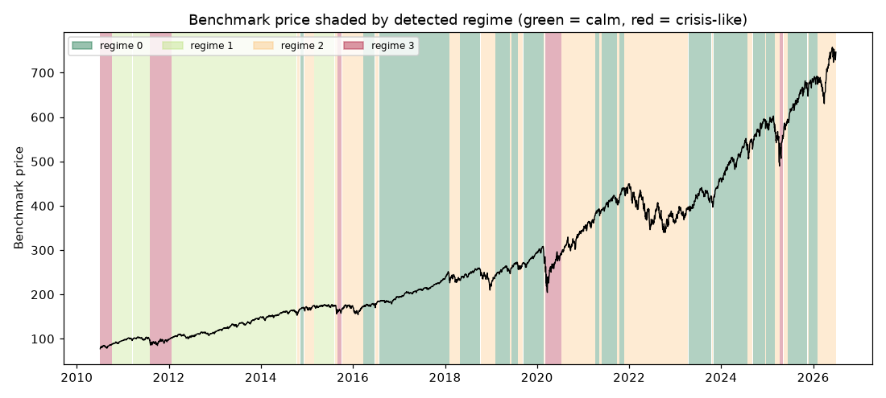

# Daily market regime research note — 2026-06-30

**Current regime: 2 (elevated) -- annualized vol 20.2%, Sharpe 0.14, historically 29% of trading days.**

## Current regime

- Regime **2** of 4 (states are numbered 0 = calmest ... 3 = most turbulent)
- Model: Gaussian HMM (`hmmlearn`), state count chosen by BIC over candidates [2, 3, 4]
- Analyst narrative source: deterministic

## Regime comparison

regime 0 (calm): ann. return 22.5%, ann. vol 9.7%, Sharpe 2.32, max drawdown -7.6%, 38% of days; regime 1 (moderate): ann. return 13.7%, ann. vol 11.8%, Sharpe 1.16, max drawdown -9.7%, 25% of days; regime 2 (elevated): ann. return 2.8%, ann. vol 20.2%, Sharpe 0.14, max drawdown -32.0%, 29% of days; regime 3 (crisis-like): ann. return 35.6%, ann. vol 35.7%, Sharpe 1.00, max drawdown -28.3%, 8% of days

## Regime statistics

|   regime |   n_days | share_of_days   | ann_return   | ann_vol   |   sharpe | max_drawdown   |   skew |   kurtosis |   n_episodes |   avg_episode_days |
|---------:|---------:|:----------------|:-------------|:----------|---------:|:---------------|-------:|-----------:|-------------:|-------------------:|
|        0 |     1537 | 38.2%           | 22.5%        | 9.7%      |     2.32 | -7.6%          |  -0.33 |       1.48 |           16 |            96.0625 |
|        1 |     1003 | 24.9%           | 13.7%        | 11.8%     |     1.16 | -9.7%          |  -0.3  |       0.99 |            4 |           250.75   |
|        2 |     1158 | 28.8%           | 2.8%         | 20.2%     |     0.14 | -32.0%         |  -0.33 |       1.38 |           21 |            55.1429 |
|        3 |      323 | 8.0%            | 35.6%        | 35.7%     |     1    | -28.3%         |  -0.21 |       5.35 |            6 |            53.8333 |

## Per-regime notes

- **Regime 0**: Calm regime: 16 distinct episodes historically, averaging 96 trading days each.
- **Regime 1**: Moderate regime: 4 distinct episodes historically, averaging 251 trading days each.
- **Regime 2**: Elevated regime: 21 distinct episodes historically, averaging 55 trading days each.
- **Regime 3**: Crisis-like regime: 6 distinct episodes historically, averaging 54 trading days each.

## Method cross-check

- HMM vs GMM label agreement: 87%
- HMM vs KMeans label agreement: 85%

## Historical event sanity check

- COVID crash onset (2020-02-19): nearest trading day 2020-02-19 was regime 0
- 2022 rate-hike selloff (2022-01-01): nearest trading day 2021-12-31 was regime 2

## Caveats

Regime separation by mean return is not statistically significant (ANOVA p=0.14); regimes here primarily separate volatility, correlation-breakdown and liquidity behavior, not average forward returns. Cross-method label agreement: HMM vs GMM 87%, HMM vs KMeans 85%.

## Outlook

This note describes historical and current statistical regime characteristics only. It is not investment advice and does not predict future returns.

---

*Generated automatically by the regime-detection-agent pipeline on 2026-06-30 22:28 UTC. Universe: SPY + XLY, XLP, XLE, XLF, XLV, XLI, XLB, XLK, XLU. This note is end-of-day, backward-looking, and not investment advice.*