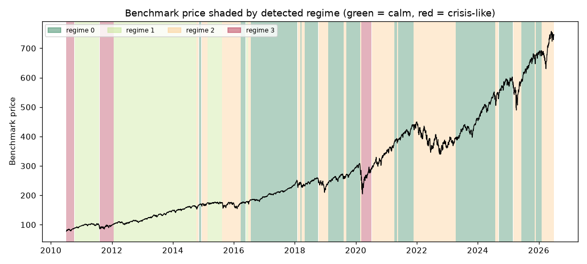

# Daily market regime research note — 2026-07-01

**Current regime: 2 (elevated) -- annualized vol 21.2%, Sharpe 0.25, historically 29% of trading days.**

## Current regime

- Regime **2** of 4 (states are numbered 0 = calmest ... 3 = most turbulent)
- Model: Gaussian HMM (`hmmlearn`), state count chosen by BIC over candidates [2, 3, 4]
- Analyst narrative source: deterministic

## Regime comparison

regime 0 (calm): ann. return 20.9%, ann. vol 10.1%, Sharpe 2.08, max drawdown -10.0%, 39% of days; regime 1 (moderate): ann. return 14.4%, ann. vol 11.8%, Sharpe 1.22, max drawdown -9.7%, 26% of days; regime 2 (elevated): ann. return 5.3%, ann. vol 21.2%, Sharpe 0.25, max drawdown -27.4%, 29% of days; regime 3 (crisis-like): ann. return 34.9%, ann. vol 35.6%, Sharpe 0.98, max drawdown -24.8%, 7% of days

## Regime statistics

|   regime |   n_days | share_of_days   | ann_return   | ann_vol   |   sharpe | max_drawdown   |   skew |   kurtosis |   n_episodes |   avg_episode_days |
|---------:|---------:|:----------------|:-------------|:----------|---------:|:---------------|-------:|-----------:|-------------:|-------------------:|
|        0 |     1568 | 39.0%           | 20.9%        | 10.1%     |     2.08 | -10.0%         |  -0.42 |       1.84 |           13 |           120.615  |
|        1 |     1029 | 25.6%           | 14.4%        | 11.8%     |     1.22 | -9.7%          |  -0.31 |       0.99 |            4 |           257.25   |
|        2 |     1155 | 28.7%           | 5.3%         | 21.2%     |     0.25 | -27.4%         |   0.07 |       4.23 |           17 |            67.9412 |
|        3 |      270 | 6.7%            | 34.9%        | 35.6%     |     0.98 | -24.8%         |  -0.55 |       5.07 |            3 |            90      |

## Per-regime notes

- **Regime 0**: Calm regime: 13 distinct episodes historically, averaging 121 trading days each.
- **Regime 1**: Moderate regime: 4 distinct episodes historically, averaging 257 trading days each.
- **Regime 2**: Elevated regime: 17 distinct episodes historically, averaging 68 trading days each.
- **Regime 3**: Crisis-like regime: 3 distinct episodes historically, averaging 90 trading days each.

## Method cross-check

- HMM vs GMM label agreement: 90%
- HMM vs KMeans label agreement: 87%

## Historical event sanity check

- COVID crash onset (2020-02-19): nearest trading day 2020-02-19 was regime 0
- 2022 rate-hike selloff (2022-01-01): nearest trading day 2021-12-31 was regime 2

## Caveats

Regime separation by mean return is not statistically significant (ANOVA p=0.30); regimes here primarily separate volatility, correlation-breakdown and liquidity behavior, not average forward returns. Cross-method label agreement: HMM vs GMM 90%, HMM vs KMeans 87%.

## Outlook

This note describes historical and current statistical regime characteristics only. It is not investment advice and does not predict future returns.

---

*Generated automatically by the regime-detection-agent pipeline on 2026-07-01 22:30 UTC. Universe: SPY + XLY, XLP, XLE, XLF, XLV, XLI, XLB, XLK, XLU. This note is end-of-day, backward-looking, and not investment advice.*