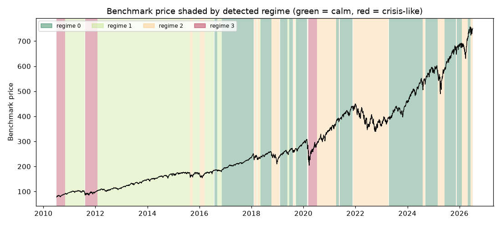

# Daily market regime research note — 2026-07-06

**Current regime: 2 (elevated) -- annualized vol 22.4%, Sharpe 0.04, historically 24% of trading days.**

## Current regime

- Regime **2** of 4 (states are numbered 0 = calmest ... 3 = most turbulent)
- Model: Gaussian HMM (`hmmlearn`), state count chosen by BIC over candidates [2, 3, 4]
- Analyst narrative source: deterministic

## Regime comparison

regime 0 (calm): ann. return 22.6%, ann. vol 10.1%, Sharpe 2.23, max drawdown -10.0%, 36% of days; regime 1 (moderate): ann. return 14.6%, ann. vol 12.2%, Sharpe 1.20, max drawdown -9.7%, 33% of days; regime 2 (elevated): ann. return 0.9%, ann. vol 22.4%, Sharpe 0.04, max drawdown -27.4%, 24% of days; regime 3 (crisis-like): ann. return 34.8%, ann. vol 34.5%, Sharpe 1.01, max drawdown -25.0%, 7% of days

## Regime statistics

|   regime |   n_days | share_of_days   | ann_return   | ann_vol   |   sharpe | max_drawdown   |   skew |   kurtosis |   n_episodes |   avg_episode_days |
|---------:|---------:|:----------------|:-------------|:----------|---------:|:---------------|-------:|-----------:|-------------:|-------------------:|
|        0 |     1452 | 36.1%           | 22.6%        | 10.1%     |     2.23 | -10.0%         |  -0.54 |       2.15 |           13 |           111.692  |
|        1 |     1337 | 33.2%           | 14.6%        | 12.2%     |     1.2  | -9.7%          |  -0.26 |       1.04 |            9 |           148.556  |
|        2 |      946 | 23.5%           | 0.9%         | 22.4%     |     0.04 | -27.4%         |   0.12 |       3.99 |           16 |            59.125  |
|        3 |      289 | 7.2%            | 34.8%        | 34.5%     |     1.01 | -25.0%         |  -0.56 |       5.57 |            3 |            96.3333 |

## Per-regime notes

- **Regime 0**: Calm regime: 13 distinct episodes historically, averaging 112 trading days each.
- **Regime 1**: Moderate regime: 9 distinct episodes historically, averaging 149 trading days each.
- **Regime 2**: Elevated regime: 16 distinct episodes historically, averaging 59 trading days each.
- **Regime 3**: Crisis-like regime: 3 distinct episodes historically, averaging 96 trading days each.

## Method cross-check

- HMM vs GMM label agreement: 97%
- HMM vs KMeans label agreement: 88%

## Historical event sanity check

- COVID crash onset (2020-02-19): nearest trading day 2020-02-19 was regime 0
- 2022 rate-hike selloff (2022-01-01): nearest trading day 2021-12-31 was regime 2

## Caveats

Regime separation by mean return is not statistically significant (ANOVA p=0.16); regimes here primarily separate volatility, correlation-breakdown and liquidity behavior, not average forward returns. Cross-method label agreement: HMM vs GMM 97%, HMM vs KMeans 88%.

## Outlook

This note describes historical and current statistical regime characteristics only. It is not investment advice and does not predict future returns.

---

*Generated automatically by the regime-detection-agent pipeline on 2026-07-06 23:02 UTC. Universe: SPY + XLY, XLP, XLE, XLF, XLV, XLI, XLB, XLK, XLU. This note is end-of-day, backward-looking, and not investment advice.*