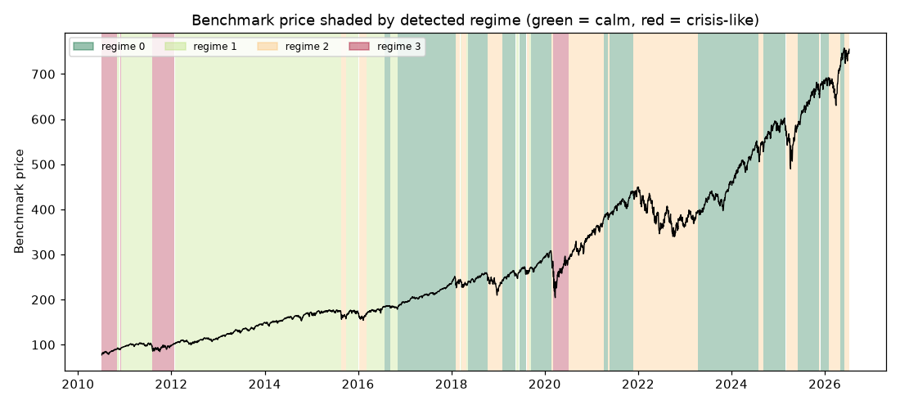

# Daily market regime research note — 2026-07-10

**Current regime: 2 (elevated) -- annualized vol 22.2%, Sharpe 0.10, historically 24% of trading days.**

## Current regime

- Regime **2** of 4 (states are numbered 0 = calmest ... 3 = most turbulent)
- Model: Gaussian HMM (`hmmlearn`), state count chosen by BIC over candidates [2, 3, 4]
- Analyst narrative source: deterministic

## Regime comparison

regime 0 (calm): ann. return 22.7%, ann. vol 10.1%, Sharpe 2.25, max drawdown -10.0%, 36% of days; regime 1 (moderate): ann. return 14.3%, ann. vol 12.2%, Sharpe 1.17, max drawdown -9.7%, 33% of days; regime 2 (elevated): ann. return 2.1%, ann. vol 22.2%, Sharpe 0.10, max drawdown -27.4%, 24% of days; regime 3 (crisis-like): ann. return 31.6%, ann. vol 34.4%, Sharpe 0.92, max drawdown -25.0%, 7% of days

## Regime statistics

|   regime |   n_days | share_of_days   | ann_return   | ann_vol   |   sharpe | max_drawdown   |   skew |   kurtosis |   n_episodes |   avg_episode_days |
|---------:|---------:|:----------------|:-------------|:----------|---------:|:---------------|-------:|-----------:|-------------:|-------------------:|
|        0 |     1451 | 36.0%           | 22.7%        | 10.1%     |     2.25 | -10.0%         |  -0.55 |       2.16 |           13 |            111.615 |
|        1 |     1332 | 33.1%           | 14.3%        | 12.2%     |     1.17 | -9.7%          |  -0.27 |       1.05 |           10 |            133.2   |
|        2 |      948 | 23.5%           | 2.1%         | 22.2%     |     0.1  | -27.4%         |   0.16 |       4.03 |           15 |             63.2   |
|        3 |      297 | 7.4%            | 31.6%        | 34.4%     |     0.92 | -25.0%         |  -0.57 |       5.5  |            4 |             74.25  |

## Per-regime notes

- **Regime 0**: Calm regime: 13 distinct episodes historically, averaging 112 trading days each.
- **Regime 1**: Moderate regime: 10 distinct episodes historically, averaging 133 trading days each.
- **Regime 2**: Elevated regime: 15 distinct episodes historically, averaging 63 trading days each.
- **Regime 3**: Crisis-like regime: 4 distinct episodes historically, averaging 74 trading days each.

## Method cross-check

- HMM vs GMM label agreement: 97%
- HMM vs KMeans label agreement: 88%

## Historical event sanity check

- COVID crash onset (2020-02-19): nearest trading day 2020-02-19 was regime 0
- 2022 rate-hike selloff (2022-01-01): nearest trading day 2021-12-31 was regime 2

## Caveats

Regime separation by mean return is not statistically significant (ANOVA p=0.22); regimes here primarily separate volatility, correlation-breakdown and liquidity behavior, not average forward returns. Cross-method label agreement: HMM vs GMM 97%, HMM vs KMeans 88%.

## Outlook

This note describes historical and current statistical regime characteristics only. It is not investment advice and does not predict future returns.

---

*Generated automatically by the regime-detection-agent pipeline on 2026-07-10 22:56 UTC. Universe: SPY + XLY, XLP, XLE, XLF, XLV, XLI, XLB, XLK, XLU. This note is end-of-day, backward-looking, and not investment advice.*