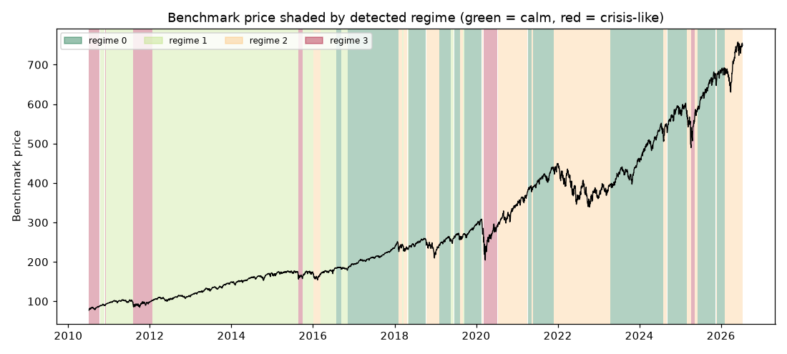

# Daily market regime research note — 2026-07-13

**Current regime: 2 (elevated) -- annualized vol 21.0%, Sharpe 0.07, historically 23% of trading days.**

## Current regime

- Regime **2** of 4 (states are numbered 0 = calmest ... 3 = most turbulent)
- Model: Gaussian HMM (`hmmlearn`), state count chosen by BIC over candidates [2, 3, 4]
- Analyst narrative source: deterministic

## Regime comparison

regime 0 (calm): ann. return 23.0%, ann. vol 10.0%, Sharpe 2.30, max drawdown -10.0%, 35% of days; regime 1 (moderate): ann. return 14.4%, ann. vol 12.1%, Sharpe 1.19, max drawdown -9.8%, 33% of days; regime 2 (elevated): ann. return 1.5%, ann. vol 21.0%, Sharpe 0.07, max drawdown -28.7%, 23% of days; regime 3 (crisis-like): ann. return 29.1%, ann. vol 35.5%, Sharpe 0.82, max drawdown -32.3%, 8% of days

## Regime statistics

|   regime |   n_days | share_of_days   | ann_return   | ann_vol   |   sharpe | max_drawdown   |   skew |   kurtosis |   n_episodes |   avg_episode_days |
|---------:|---------:|:----------------|:-------------|:----------|---------:|:---------------|-------:|-----------:|-------------:|-------------------:|
|        0 |     1422 | 35.3%           | 23.0%        | 10.0%     |     2.3  | -10.0%         |  -0.48 |       1.92 |           12 |           118.5    |
|        1 |     1349 | 33.5%           | 14.4%        | 12.1%     |     1.19 | -9.8%          |  -0.27 |       1.06 |           10 |           134.9    |
|        2 |      925 | 23.0%           | 1.5%         | 21.0%     |     0.07 | -28.7%         |  -0.28 |       1.29 |           14 |            66.0714 |
|        3 |      333 | 8.3%            | 29.1%        | 35.5%     |     0.82 | -32.3%         |  -0.21 |       5.31 |            6 |            55.5    |

## Per-regime notes

- **Regime 0**: Calm regime: 12 distinct episodes historically, averaging 118 trading days each.
- **Regime 1**: Moderate regime: 10 distinct episodes historically, averaging 135 trading days each.
- **Regime 2**: Elevated regime: 14 distinct episodes historically, averaging 66 trading days each.
- **Regime 3**: Crisis-like regime: 6 distinct episodes historically, averaging 56 trading days each.

## Method cross-check

- HMM vs GMM label agreement: 96%
- HMM vs KMeans label agreement: 87%

## Historical event sanity check

- COVID crash onset (2020-02-19): nearest trading day 2020-02-19 was regime 0
- 2022 rate-hike selloff (2022-01-01): nearest trading day 2021-12-31 was regime 2

## Caveats

Regime separation by mean return is not statistically significant (ANOVA p=0.22); regimes here primarily separate volatility, correlation-breakdown and liquidity behavior, not average forward returns. Cross-method label agreement: HMM vs GMM 96%, HMM vs KMeans 87%.

## Outlook

This note describes historical and current statistical regime characteristics only. It is not investment advice and does not predict future returns.

---

*Generated automatically by the regime-detection-agent pipeline on 2026-07-13 22:51 UTC. Universe: SPY + XLY, XLP, XLE, XLF, XLV, XLI, XLB, XLK, XLU. This note is end-of-day, backward-looking, and not investment advice.*