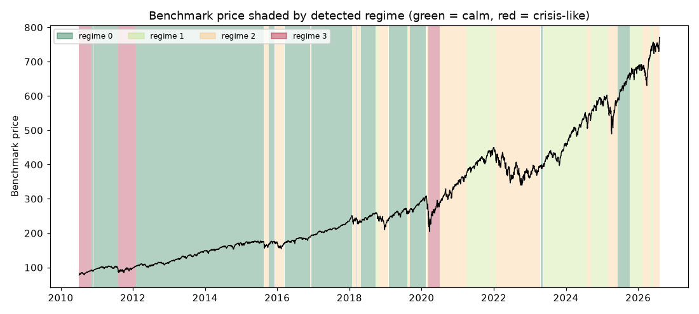

# Daily market regime research note — 2026-08-05

**Current regime: 2 (elevated) -- annualized vol 22.2%, Sharpe 0.27, historically 23% of trading days.**

## Current regime

- Regime **2** of 4 (states are numbered 0 = calmest ... 3 = most turbulent)
- Model: Gaussian HMM (`hmmlearn`), state count chosen by BIC over candidates [2, 3, 4]
- Analyst narrative source: deterministic

## Regime comparison

regime 0 (calm): ann. return 17.7%, ann. vol 11.0%, Sharpe 1.61, max drawdown -9.7%, 51% of days; regime 1 (moderate): ann. return 16.9%, ann. vol 12.1%, Sharpe 1.39, max drawdown -10.0%, 19% of days; regime 2 (elevated): ann. return 6.0%, ann. vol 22.2%, Sharpe 0.27, max drawdown -22.1%, 23% of days; regime 3 (crisis-like): ann. return 31.1%, ann. vol 34.7%, Sharpe 0.90, max drawdown -24.9%, 7% of days

## Regime statistics

|   regime |   n_days | share_of_days   | ann_return   | ann_vol   |   sharpe | max_drawdown   |   skew |   kurtosis |   n_episodes |   avg_episode_days |
|---------:|---------:|:----------------|:-------------|:----------|---------:|:---------------|-------:|-----------:|-------------:|-------------------:|
|        0 |     2049 | 50.6%           | 17.7%        | 11.0%     |     1.61 | -9.7%          |  -0.35 |       1.72 |           12 |           170.75   |
|        1 |      772 | 19.1%           | 16.9%        | 12.1%     |     1.39 | -10.0%         |  -0.44 |       1.03 |            9 |            85.7778 |
|        2 |      934 | 23.1%           | 6.0%         | 22.2%     |     0.27 | -22.1%         |   0.14 |       4.15 |           15 |            62.2667 |
|        3 |      291 | 7.2%            | 31.1%        | 34.7%     |     0.9  | -24.9%         |  -0.57 |       5.38 |            4 |            72.75   |

## Per-regime notes

- **Regime 0**: Calm regime: 12 distinct episodes historically, averaging 171 trading days each.
- **Regime 1**: Moderate regime: 9 distinct episodes historically, averaging 86 trading days each.
- **Regime 2**: Elevated regime: 15 distinct episodes historically, averaging 62 trading days each.
- **Regime 3**: Crisis-like regime: 4 distinct episodes historically, averaging 73 trading days each.

## Method cross-check

- HMM vs GMM label agreement: 46%
- HMM vs KMeans label agreement: 45%

## Historical event sanity check

- COVID crash onset (2020-02-19): nearest trading day 2020-02-19 was regime 1
- 2022 rate-hike selloff (2022-01-01): nearest trading day 2021-12-31 was regime 1

## Caveats

Regime separation by mean return is not statistically significant (ANOVA p=0.52); regimes here primarily separate volatility, correlation-breakdown and liquidity behavior, not average forward returns. Cross-method label agreement: HMM vs GMM 46%, HMM vs KMeans 45%.

## Outlook

This note describes historical and current statistical regime characteristics only. It is not investment advice and does not predict future returns.

---

*Generated automatically by the regime-detection-agent pipeline on 2026-08-05 22:53 UTC. Universe: SPY + XLY, XLP, XLE, XLF, XLV, XLI, XLB, XLK, XLU. This note is end-of-day, backward-looking, and not investment advice.*