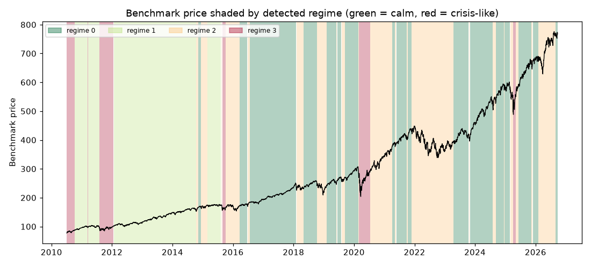

# Daily market regime research note — 2026-09-25

**Current regime: 0 (calm) -- annualized vol 9.7%, Sharpe 2.34, historically 38% of trading days.**

## Current regime

- Regime **0** of 4 (states are numbered 0 = calmest ... 3 = most turbulent)
- Model: Gaussian HMM (`hmmlearn`), state count chosen by BIC over candidates [2, 3, 4]
- Analyst narrative source: deterministic

## Regime comparison

regime 0 (calm): ann. return 22.7%, ann. vol 9.7%, Sharpe 2.34, max drawdown -7.6%, 38% of days; regime 1 (moderate): ann. return 14.0%, ann. vol 11.8%, Sharpe 1.18, max drawdown -9.7%, 25% of days; regime 2 (elevated): ann. return 3.4%, ann. vol 19.7%, Sharpe 0.17, max drawdown -32.9%, 29% of days; regime 3 (crisis-like): ann. return 31.8%, ann. vol 35.7%, Sharpe 0.89, max drawdown -28.3%, 8% of days

## Regime statistics

|   regime |   n_days | share_of_days   | ann_return   | ann_vol   |   sharpe | max_drawdown   |   skew |   kurtosis |   n_episodes |   avg_episode_days |
|---------:|---------:|:----------------|:-------------|:----------|---------:|:---------------|-------:|-----------:|-------------:|-------------------:|
|        0 |     1552 | 38.0%           | 22.7%        | 9.7%      |     2.34 | -7.6%          |  -0.31 |       1.44 |           17 |            91.2941 |
|        1 |     1004 | 24.6%           | 14.0%        | 11.8%     |     1.18 | -9.7%          |  -0.3  |       0.98 |            4 |           251      |
|        2 |     1193 | 29.2%           | 3.4%         | 19.7%     |     0.17 | -32.9%         |  -0.33 |       1.44 |           21 |            56.8095 |
|        3 |      332 | 8.1%            | 31.8%        | 35.7%     |     0.89 | -28.3%         |  -0.2  |       5.14 |            6 |            55.3333 |

## Per-regime notes

- **Regime 0**: Calm regime: 17 distinct episodes historically, averaging 91 trading days each.
- **Regime 1**: Moderate regime: 4 distinct episodes historically, averaging 251 trading days each.
- **Regime 2**: Elevated regime: 21 distinct episodes historically, averaging 57 trading days each.
- **Regime 3**: Crisis-like regime: 6 distinct episodes historically, averaging 55 trading days each.

## Method cross-check

- HMM vs GMM label agreement: 89%
- HMM vs KMeans label agreement: 84%

## Historical event sanity check

- COVID crash onset (2020-02-19): nearest trading day 2020-02-19 was regime 0
- 2022 rate-hike selloff (2022-01-01): nearest trading day 2021-12-31 was regime 2

## Caveats

Regime separation by mean return is not statistically significant (ANOVA p=0.19); regimes here primarily separate volatility, correlation-breakdown and liquidity behavior, not average forward returns. Cross-method label agreement: HMM vs GMM 89%, HMM vs KMeans 84%.

## Outlook

This note describes historical and current statistical regime characteristics only. It is not investment advice and does not predict future returns.

---

*Generated automatically by the regime-detection-agent pipeline on 2026-09-26 00:19 UTC. Universe: SPY + XLY, XLP, XLE, XLF, XLV, XLI, XLB, XLK, XLU. This note is end-of-day, backward-looking, and not investment advice.*