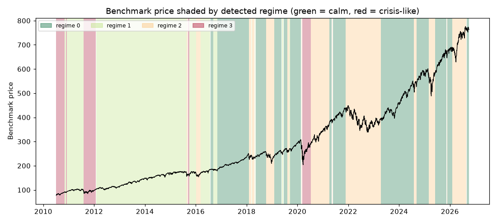

# Daily market regime research note — 2026-10-02

**Current regime: 0 (calm) -- annualized vol 10.0%, Sharpe 2.23, historically 35% of trading days.**

## Current regime

- Regime **0** of 4 (states are numbered 0 = calmest ... 3 = most turbulent)
- Model: Gaussian HMM (`hmmlearn`), state count chosen by BIC over candidates [2, 3, 4]
- Analyst narrative source: deterministic

## Regime comparison

regime 0 (calm): ann. return 22.4%, ann. vol 10.0%, Sharpe 2.23, max drawdown -10.0%, 35% of days; regime 1 (moderate): ann. return 14.3%, ann. vol 12.2%, Sharpe 1.17, max drawdown -9.7%, 33% of days; regime 2 (elevated): ann. return 2.7%, ann. vol 21.9%, Sharpe 0.12, max drawdown -27.4%, 24% of days; regime 3 (crisis-like): ann. return 30.5%, ann. vol 33.6%, Sharpe 0.91, max drawdown -27.5%, 8% of days

## Regime statistics

|   regime |   n_days | share_of_days   | ann_return   | ann_vol   |   sharpe | max_drawdown   |   skew |   kurtosis |   n_episodes |   avg_episode_days |
|---------:|---------:|:----------------|:-------------|:----------|---------:|:---------------|-------:|-----------:|-------------:|-------------------:|
|        0 |     1449 | 35.5%           | 22.4%        | 10.0%     |     2.23 | -10.0%         |  -0.46 |       1.85 |           13 |           111.462  |
|        1 |     1331 | 32.6%           | 14.3%        | 12.2%     |     1.17 | -9.7%          |  -0.27 |       1.05 |           10 |           133.1    |
|        2 |      988 | 24.2%           | 2.7%         | 21.9%     |     0.12 | -27.4%         |   0.14 |       4.24 |           14 |            70.5714 |
|        3 |      318 | 7.8%            | 30.5%        | 33.6%     |     0.91 | -27.5%         |  -0.57 |       5.75 |            5 |            63.6    |

## Per-regime notes

- **Regime 0**: Calm regime: 13 distinct episodes historically, averaging 111 trading days each.
- **Regime 1**: Moderate regime: 10 distinct episodes historically, averaging 133 trading days each.
- **Regime 2**: Elevated regime: 14 distinct episodes historically, averaging 71 trading days each.
- **Regime 3**: Crisis-like regime: 5 distinct episodes historically, averaging 64 trading days each.

## Method cross-check

- HMM vs GMM label agreement: 12%
- HMM vs KMeans label agreement: 86%

## Historical event sanity check

- COVID crash onset (2020-02-19): nearest trading day 2020-02-19 was regime 0
- 2022 rate-hike selloff (2022-01-01): nearest trading day 2021-12-31 was regime 2

## Caveats

Regime separation by mean return is not statistically significant (ANOVA p=0.24); regimes here primarily separate volatility, correlation-breakdown and liquidity behavior, not average forward returns. Cross-method label agreement: HMM vs GMM 12%, HMM vs KMeans 86%.

## Outlook

This note describes historical and current statistical regime characteristics only. It is not investment advice and does not predict future returns.

---

*Generated automatically by the regime-detection-agent pipeline on 2026-10-03 00:53 UTC. Universe: SPY + XLY, XLP, XLE, XLF, XLV, XLI, XLB, XLK, XLU. This note is end-of-day, backward-looking, and not investment advice.*